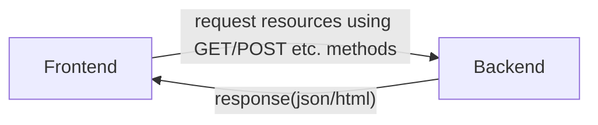

- http is a protocol , protocol means rules
- following http rules there are some methods
    - GET
    - POST
    - PUT
    - PATCH
    - DELETE
    - 99% applications created using these methods
  ------

If frontend requests to create something then it should request by post method 